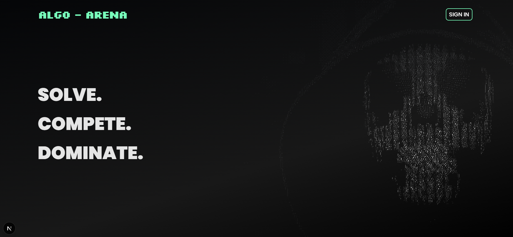
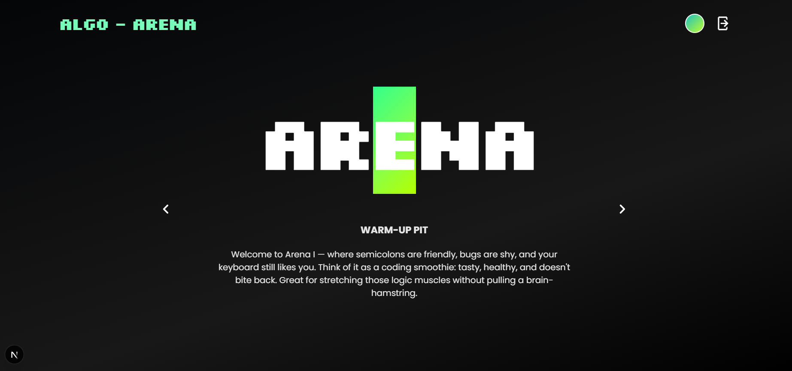
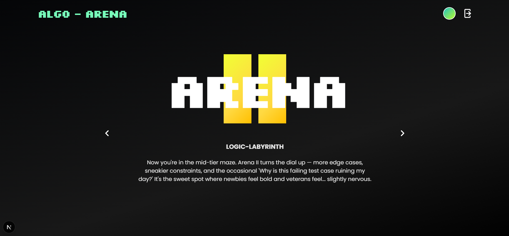
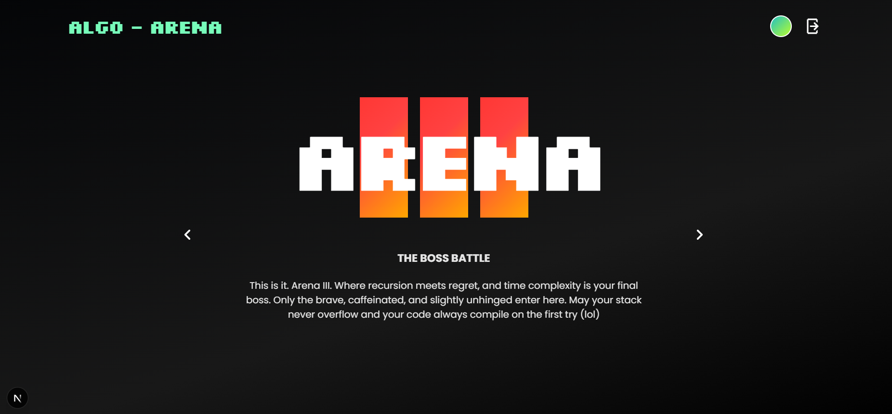
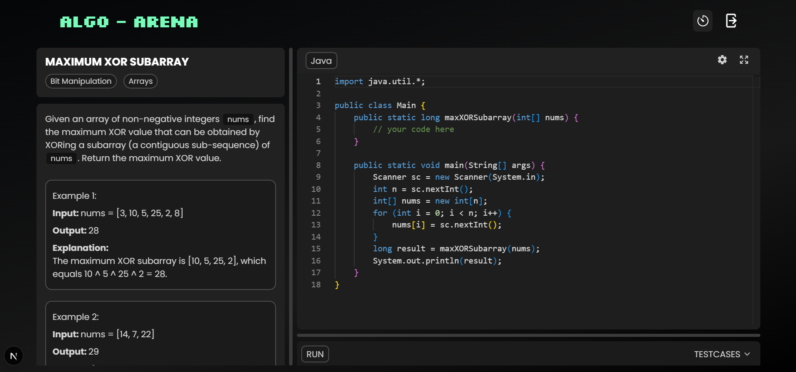
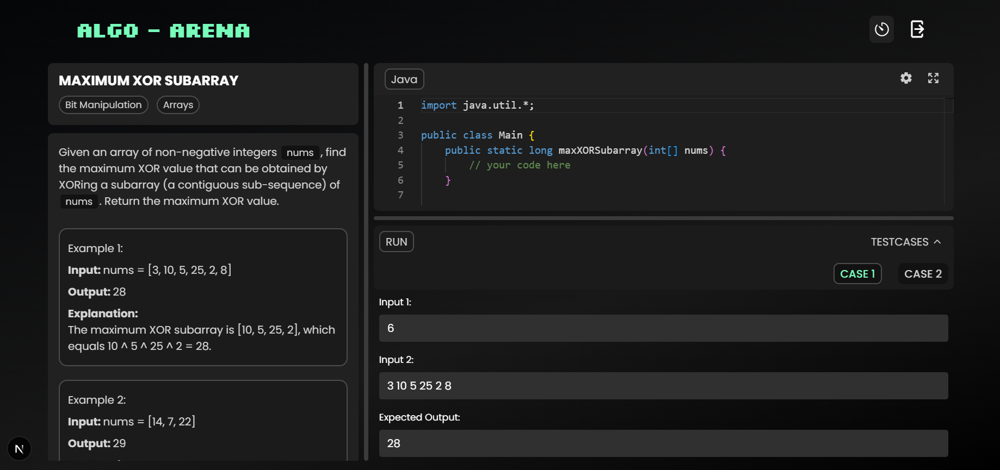

# 🧠 ALGO-ARENA

**ALGO-ARENA** is a dynamic DSA and Algorithms practice platform built with **Next.js** and **React**, designed to simulate coding arenas of increasing difficulty.

It leverages **Gemini API** for AI-powered random problem generation and **Judge0 API** for real-time code execution. Built with a focus on responsiveness, modularity, and a clean developer experience.

---

## 🚀 Features

- 🔐 **Authentication with Firebase**
  - Sign up, sign in, and password reset
- 🏟️ **Three difficulty-based Arenas**
  - Arena 1 (Easy), Arena 2 (Medium), Arena 3 (Hard)
- 🤖 **AI-Powered Question Generation**
  - Gemini API generates random problems (title, description, constraints, testcases, boilerplate)
- 🧪 **Run Code with Judge0 API**
  - Supports real-time code execution and custom testcases
- 💻 **Code Editor with Monaco**
  - Clean and responsive split-pane layout
  - Auto-scrollable problem description, editor, and console
- 🔁 **Fully frontend-driven architecture**
  - No backend = virtually **unlimited problem generation potential**

---

## 📸 Screenshots

*ALGO-ARENA landing page.*

*Arena difficulty selection screens.*

*Dynamically generated problem with editor and console.*

---

## ⚙️ Tech Stack

### Frontend
- **Next.js**, **React**, **TypeScript**
- **Monaco Editor**
- **React Split** for layout

### APIs & Integrations
- **Gemini API** (problem generation)
- **Judge0 API** (code execution)
- **Firebase Auth** (user login & management)
